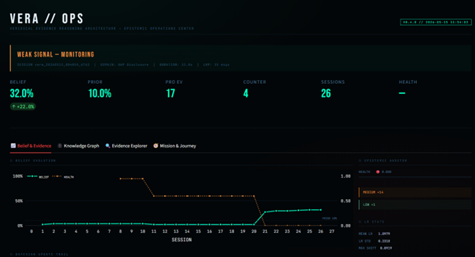

<div align="center">

```
╔══════════════════════════════════════════════════════════════╗
║                                                              ║
║          V E R A                                             ║
║          Veridical Evidence Reasoning Architecture           ║
║                                                              ║
║          The world's first open-source                       ║
║          Automated Epistemology Engine                       ║
║                                                              ║
╚══════════════════════════════════════════════════════════════╝
```

[](LICENSE)
[](https://python.org)
[](https://github.com/IrsanAI)
[]()
[](https://github.com/IrsanAI/IrsanAI-VERA/actions)

🌐 **Language:** [Deutsch](#deutsch) | [English](#english)

---

*"Not another AI that collects information.*
*A machine that earns the right to believe."*

</div>

---


## What is VERA?

VERA is not an OSINT tool. It is not a search engine. It is not a chatbot wrapper.

**VERA is an Automated Epistemology Engine** — a system that does what rigorous scientists, intelligence analysts, and judges do manually:

1. **Collect** evidence from real, heterogeneous sources
2. **Challenge** every conclusion with an adversarial Red Team Agent
3. **Update** beliefs mathematically via Bayesian probability — never hardcoded values
4. **Document** the full provenance chain of every single claim
5. **Monitor** its own reasoning process for 7 types of cognitive bias
6. **Export** everything into a navigable Obsidian Knowledge Graph

**The UAP/Disclosure domain is the proof-of-concept stress test.**
If VERA works in the world's most adversarial information environment, it works everywhere.

---

## Live Results (May 2026)

| Metric | Value |
|--------|-------|
| Investigation sessions | `26` |
| Current belief | `32.0%` (prior: 10.0%) |
| Net shift | `+22.0%` |
| Latest verdict | **Weak signal — monitoring** |
| Pro-evidence / session | `17` (GitHub repos) |
| Counter-evidence / session | `4` (Red Team) |
| Avg session time | `28.1s` |
| System health | 🟡 `0.466` (BUG-001 known → v0.5.0) |

*VERA started blind. 11 of 26 sessions found zero pro-evidence. Query strategy was refined. Signal emerged in session 12 and has held since.*

---

## The Architecture

```
╔══════════════════════════════════════════════════════════════════════╗
║              IrsanAI-VERA — Architecture v0.4.0                     ║
╠══════════════════════════════════════════════════════════════════════╣
║                                                                      ║
║  Domain Ontology (.yaml) ──► vera.py ──► InvestigationCycle         ║
║                                               │                     ║
║                    ┌──────────────────────────┼──────────────┐      ║
║                    ▼                          ▼              ▼      ║
║            HF_AGENT              GH_AGENT           RED_TEAM        ║
║            (OSINT/HF)            (OSINT/GitHub)      (Adversarial)  ║
║                    └──────────────────────────┼──────────────┘      ║
║                                               ▼                     ║
║                              BayesianBeliefUpdater                  ║
║                              (Prior → Posterior via Odds-form Bayes) ║
║                                               │                     ║
║                    ┌──────────────────────────┼──────────────┐      ║
║                    ▼                          ▼              ▼      ║
║             EpistemicAuditor        ObsidianExporter    DataStore   ║
║             7 bias detectors        vault/*.md          data/*.json  ║
║                                                                      ║
║  LRPBus v1.3 — all agent communication is typed + auditable         ║
║  Dashboard v4 — 4 tabs · Knowledge Graph · Mission & Journey        ║
║  CIP v2.0 — VERA scans herself via AST · recruits AI collaborators  ║
╚══════════════════════════════════════════════════════════════════════╝
```

---

## The Three Musketeers

Inspired by *"Ipcha Mistabra"* — the Israeli intelligence technique behind the Devil's Advocate Office created after the 1973 Yom Kippur War:

| Unit | Module | Role | Status |
|------|--------|------|--------|
| ⚖️ **Bayes** | `core/bayesian/updater.py` | Mathematical conscience | ✅ |
| ⚔️ **Adversary** | `agents/red_team.py` | Active counter-evidence seeker | ✅ |
| 🔗 **Provenance** | `core/bayesian/evidence.py` | Chain of custody for every claim | ✅ |
| 🎯 **Conductor** | `core/autopilot.py` | Resonance controller | 📋 v0.5.0 |

Two units cannot form a coalition against the third. Two against one = negative reward = system degradation.

---

## Three Golden Protocols

**Lex Bayesian** — No belief can reach 1.0 or 0.0. Absolute certainty is forbidden.

**Lex Adversaria** — The more certain VERA becomes, the harder the Red Team attacks. Confidence scales adversarial pressure.

**Lex Proventia** — No evidence without verifiable provenance. No source = trust weight zero = no influence.

---

## What's Built (v0.4.0) ✅

| Module | Note |
|--------|------|
| Ontology Loader | YAML-driven domain switching — zero code changes |
| Bayesian Core | True Odds-form Bayes, no hardcoded values |
| GitHub OSINT Agent | Real Search API, quality filtering |
| HuggingFace OSINT Agent | Real API, funnel query strategy |
| Red Team Agent | Adversarial counter-evidence, always lowers belief |
| LRP v1.3 Messenger | Typed inter-agent comms, full audit log |
| Epistemic Auditor | 7 bias detectors, health scores per session |
| Obsidian Vault Exporter | Sessions, evidence, entities as linked Markdown |
| **Dashboard v4** | Epistemic Ops Center — 4 tabs, live Knowledge Graph |
| **CIP v2.0** | Community Intelligence Protocol — AST self-scan |
| VERA_MANIFEST + CI | GitHub Actions gate on every push |

**v0.5.0 (open for contribution):** Autopilot · ChromaDB Memory · NLP Semantic Agent · Knowledge Graph · FastAPI Backend

---

## Dashboard v4 — Epistemic Operations Center

```bash
streamlit run dashboard/app.py
```

**📈 Belief & Evidence** — Live belief curve with health overlay, Bayesian update trail with interleaved pro/counter markers.

**🕸️ Knowledge Graph** — Live NetworkX visualization of the Obsidian vault. Hover any node for details. Sessions (cyan) · Evidence (blue) · Counter (red) · Entities (amber).

**🔍 Evidence Explorer** — Filterable by direction and source type.

**🧭 Mission & Journey** — The full epistemic story arc. Domain intent from YAML. Belief trajectory from blind → signal. Change the ontology and VERA reasons in a new direction — instantly.

---

## Community Intelligence Protocol (CIP v2.0)

VERA recruits her own collaborators. She scans her source code via AST, measures her epistemic health, identifies her defects, and generates a document precise enough for any AI system to start writing code immediately.

```bash
# Full deep report for Claude
python .tools/irsanai_cip_v2.py --target claude --depth deep

# Single module focus for Codex
python .tools/irsanai_cip_v2.py --module M-001 --target codex

# Register a new idea
python .tools/irsanai_cip_v2.py --register-idea "Your idea"
```

The CIP includes: live epistemic state · real AST-extracted class signatures · known bugs with fix hints · precise module interfaces · Hall of Actives · Idea Graph.

---

## Domain Agnosticism

```bash
python vera.py --ontology ontologies/uap.yaml       # UAP Disclosure (active)
python vera.py --ontology ontologies/oncology.yaml  # Medical fraud (community)
python vera.py --ontology ontologies/finance.yaml   # Financial crime (community)
```

One YAML swap. Zero code changes. Same engine, different domain.

---

## Quickstart

```bash
git clone https://github.com/IrsanAI/IrsanAI-VERA.git
cd IrsanAI-VERA

python -m venv .venv
.venv\Scripts\activate        # Windows
# source .venv/bin/activate   # Linux/Mac

pip install -r requirements.txt

cp .env.example .env
# Fill in GITHUB_TOKEN in .env

python vera.py --ontology ontologies/uap.yaml
streamlit run dashboard/app.py
```

---

## Roadmap

| Version | Focus | Status |
|---------|-------|--------|
| v0.4.0 | Full operational system | ✅ Complete |
| v0.5.0 | Autopilot · ChromaDB · NLP · Graph | 🔨 Open |
| v0.6.0 | FastAPI · Docker · HuggingFace Spaces | 📋 Planned |
| v1.0.0 | Production · multi-domain · full tests | 📋 Planned |

See [ROADMAP.md](ROADMAP.md) · [VISION.md](VISION.md) · [CONTRIBUTING.md](CONTRIBUTING.md)

---

## Contributing

Every open module is a precise invitation. See [CONTRIBUTING.md](CONTRIBUTING.md).

Or run the CIP and send it to any AI — VERA handles the rest.

---

## Support

VERA is free. Forever. For everyone.

If it brought you value:

*PayPal · Revolut · IBAN — contact via GitHub Issues*

Build first. Share first. The world benefits first.

---

<a name="deutsch"></a>

## Was ist VERA? (Deutsch)

VERA ist kein OSINT-Tool. Kein Suchwerkzeug. Kein Chatbot-Wrapper.

**VERA ist eine Automated Epistemology Engine.** 26 Sessions. Belief von 10% auf 32%. Verdict: "Weak signal — monitoring". Das System arbeitet.

Vollständige Dokumentation auf Englisch oben. Für Fragen: GitHub Issues.

---

<div align="center">

*Built with metacognitive precision by IrsanAI. Given to the world.*

</div>